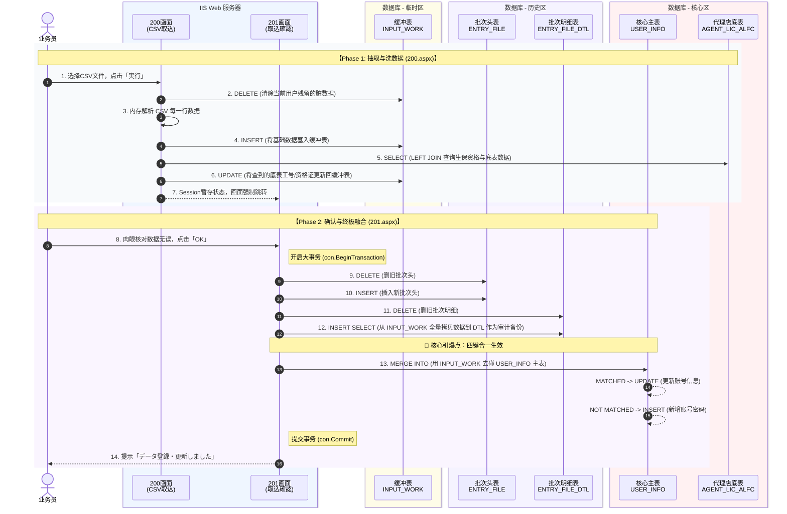

sequenceDiagram
    autonumber
    

```mermaid
sequenceDiagram
    autonumber
    
    actor User as 业务员
    
    box rgb(239, 246, 255) IIS Web 服务器
    participant Web200 as 200画面<br>(CSV取込)
    participant Web201 as 201画面<br>(取込確認)
    end
    
    box rgb(254, 252, 232) 数据库 - 临时区
    participant DB_WORK as 缓冲表<br>INPUT_WORK
    end

    box rgb(245, 243, 255) 数据库 - 历史区
    participant DB_FILE as 批次头表<br>ENTRY_FILE
    participant DB_DTL as 批次明细表<br>ENTRY_FILE_DTL
    end

    box rgb(255, 241, 242) 数据库 - 核心区
    participant DB_USER as 核心主表<br>USER_INFO
    participant DB_AGENT as 代理店底表<br>AGENT_LIC_ALFC
    end

    %% ==== 第一阶段：上传与缓冲 ====
    rect rgb(248, 250, 252)
    Note over User, DB_AGENT: 【Phase 1: 抽取与洗数据 (200.aspx)】
    User->>Web200: 1. 选择CSV文件，点击「実行」
    Web200->>DB_WORK: 2. DELETE (清除当前用户残留的脏数据)
    Web200->>Web200: 3. 内存解析 CSV 每一行数据
    Web200->>DB_WORK: 4. INSERT (将基础数据塞入缓冲表)
    Web200->>DB_AGENT: 5. SELECT (LEFT JOIN 查询生保资格与底表数据)
    Web200->>DB_WORK: 6. UPDATE (将查到的底表工号/资格证更新回缓冲表)
    Web200-->>Web201: 7. Session暂存状态，画面强制跳转
    end

    %% ==== 第二阶段：确认与落库 ====
    rect rgb(250, 245, 255)
    Note over User, DB_USER: 【Phase 2: 确认与终极融合 (201.aspx)】
    User->>Web201: 8. 肉眼核对数据无误，点击「OK」
    
    Note right of Web201: 开启大事务 (con.BeginTransaction)
    
    Web201->>DB_FILE: 9. DELETE (删旧批次头)
    Web201->>DB_FILE: 10. INSERT (插入新批次头)
    
    Web201->>DB_DTL: 11. DELETE (删旧批次明细)
    Web201->>DB_DTL: 12. INSERT SELECT (从 INPUT_WORK 全量拷贝数据到 DTL 作为审计备份)
    
    Note over Web201, DB_USER: 🌟 核心引爆点：四键合一生效
    Web201->>DB_USER: 13. MERGE INTO (用 INPUT_WORK 去碰 USER_INFO 主表)
    DB_USER-->>DB_USER: MATCHED -> UPDATE (更新账号信息)
    DB_USER-->>DB_USER: NOT MATCHED -> INSERT (新增账号密码)
    
    Note right of Web201: 提交事务 (con.Commit)
    
    Web201-->>User: 14. 提示「データ登録・更新しました」
    end
```