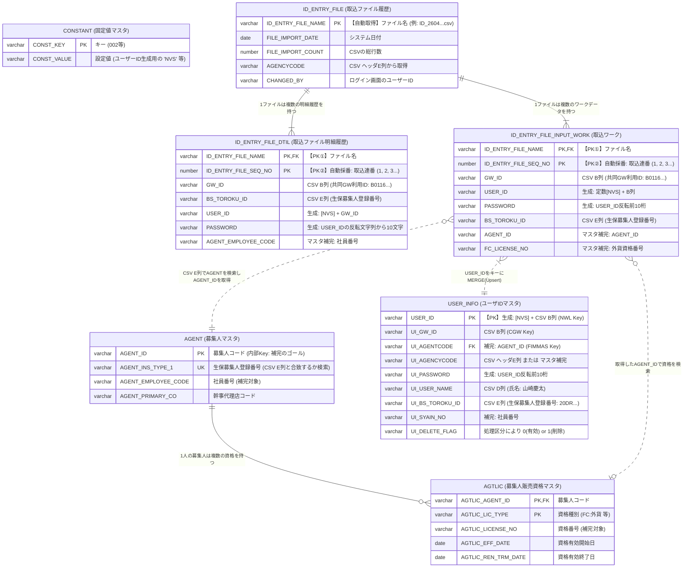

erDiagram
    %% ==========================================
    %% 1. マスタデータ層（Read-Only / 補完用）
    %% ==========================================
    AGENT ["AGENT (募集人マスタ)"] {
        varchar AGENT_ID PK "募集人コード (内部Key: 補完のゴール)"
        varchar AGENT_INS_TYPE_1 UK "生保募集人登録番号 (CSV E列と合致するか検索)"
        varchar AGENT_EMPLOYEE_CODE "社員番号 (補完対象)"
        varchar AGENT_PRIMARY_CO "幹事代理店コード"
    }

