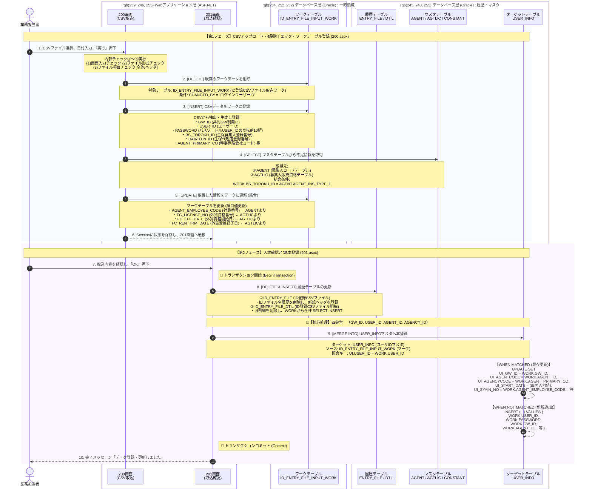

    

```mermaid
sequenceDiagram
    autonumber
    
    actor User as 業務担当者
    
    box rgb(239, 246, 255) Webアプリケーション層 (ASP.NET)
    participant Web200 as 200画面<br>(CSV取込)
    participant Web201 as 201画面<br>(取込確認)
    end
    
    box rgb(254, 252, 232) データベース層 (Oracle) : 一時領域
    participant DB_WORK as ワークテーブル<br>ID_ENTRY_FILE_INPUT_WORK
    end

    box rgb(245, 243, 255) データベース層 (Oracle) : 履歴・マスタ
    participant DB_AUDIT as 履歴テーブル<br>ENTRY_FILE / DTIL
    participant DB_MASTER as マスタテーブル<br>AGENT / AGTLIC / CONSTANT
    participant DB_USER as ターゲットテーブル<br>USER_INFO
    end

    %% ==========================================
    %% 第1フェーズ：バリデーションと一時保存 (200.aspx)
    %% ==========================================
    rect rgb(248, 250, 252)
    Note over User, DB_USER: 【第1フェーズ】CSVアップロード・4段階チェック・ワークテーブル登録 (200.aspx)
    
    User->>Web200: 1. CSVファイル選択、日付入力、「実行」押下
    
    Note over Web200: 内部チェック①〜③実行<br/>(1)画面入力チェック (2)ファイル形式チェック<br/>(3)ファイル項目チェック[全体/ヘッダ]
    
    Web200->>DB_WORK: 2. [DELETE] 既存のワークデータを削除
    Note over Web200, DB_WORK: 対象テーブル: ID_ENTRY_FILE_INPUT_WORK (ID登録CSVファイル取込ワーク)<br/>条件: CHANGED_BY = 'ログインユーザーID'
    
    Web200->>DB_WORK: 3. [INSERT] CSVデータをワークに登録
    Note over Web200, DB_WORK: CSVから抽出・生成し登録:<br/>・GW_ID (共同GW利用ID)<br/>・USER_ID (ユーザーID)<br/>・PASSWORD (パスワード※USER_IDの反転前10桁)<br/>・BS_TOROKU_ID (生保募集人登録番号)<br/>・DAIRITEN_ID (生保代理店登録番号)<br/>・AGENT_PRIMARY_CO (幹事保険会社コード) 等
    
    Web200->>DB_MASTER: 4. [SELECT] マスタテーブルから不足情報を取得
    Note over Web200, DB_MASTER: 取得元:<br/>① AGENT (募集人コードテーブル)<br/>② AGTLIC (募集人販売資格テーブル)<br/>結合条件:<br/>WORK.BS_TOROKU_ID = AGENT.AGENT_INS_TYPE_1
    
    Web200->>DB_WORK: 5. [UPDATE] 取得した情報をワークに更新 (結合)
    Note over Web200, DB_WORK: ワークテーブルを更新 (項目値更新):<br/>・AGENT_EMPLOYEE_CODE (社員番号) ← AGENTより<br/>・FC_LICENSE_NO (外貨資格番号) ← AGTLICより<br/>・FC_EFF_DATE (外貨資格開始日) ← AGTLICより<br/>・FC_REN_TRM_DATE (外貨資格終了日) ← AGTLICより
    
    Web200-->>Web201: 6. Sessionに状態を保存し、201画面へ遷移
    end

    %% ==========================================
    %% 第2フェーズ：人端確認と本登録 (201.aspx)
    %% ==========================================
    rect rgb(250, 245, 255)
    Note over User, DB_USER: 【第2フェーズ】人端確認とDB本登録 (201.aspx)
    
    User->>Web201: 7. 取込内容を確認し、「OK」押下
    
    Note right of Web201: 🚨 トランザクション開始 (BeginTransaction)
    
    Web201->>DB_AUDIT: 8. [DELETE & INSERT] 履歴テーブルの更新
    Note over Web201, DB_AUDIT: ① ID_ENTRY_FILE (ID登録CSVファイル)<br/>　・旧ファイル名履歴を削除し、新規ヘッダを登録<br/>② ID_ENTRY_FILE_DTIL (ID登録CSVファイル明細)<br/>　・旧明細を削除し、WORKから全件 SELECT INSERT
    
    Note over Web201, DB_USER: 🌟【核心処理】四鍵合一（GW_ID, USER_ID, AGENT_ID, AGENCY_ID）
    Web201->>DB_USER: 9. [MERGE INTO] USER_INFOマスタへ本登録
    
    Note over Web201, DB_USER: ターゲット: USER_INFO (ユーザIDマスタ)<br/>ソース: ID_ENTRY_FILE_INPUT_WORK (ワーク)<br/>照合キー: UI.USER_ID = WORK.USER_ID
    
    DB_USER-->>DB_USER: 【WHEN MATCHED (既存更新)】<br/>UPDATE SET <br/> UI_GW_ID = WORK.GW_ID,<br/> UI_AGENTCODE = WORK.AGENT_ID,<br/> UI_AGENCYCODE = WORK.AGENT_PRIMARY_CO,<br/> UI_START_DATE = (画面入力値),<br/> UI_SYAIN_NO = WORK.AGENT_EMPLOYEE_CODE... 等
    
    DB_USER-->>DB_USER: 【WHEN NOT MATCHED (新規追加)】<br/>INSERT (...) VALUES (<br/> WORK.USER_ID,<br/> WORK.PASSWORD,<br/> WORK.GW_ID,<br/> WORK.AGENT_ID... 等 )
    
    Note right of Web201: 🚨 トランザクションコミット (Commit)
    
    Web201-->>User: 10. 完了メッセージ「データ登録・更新しました」
    end
```