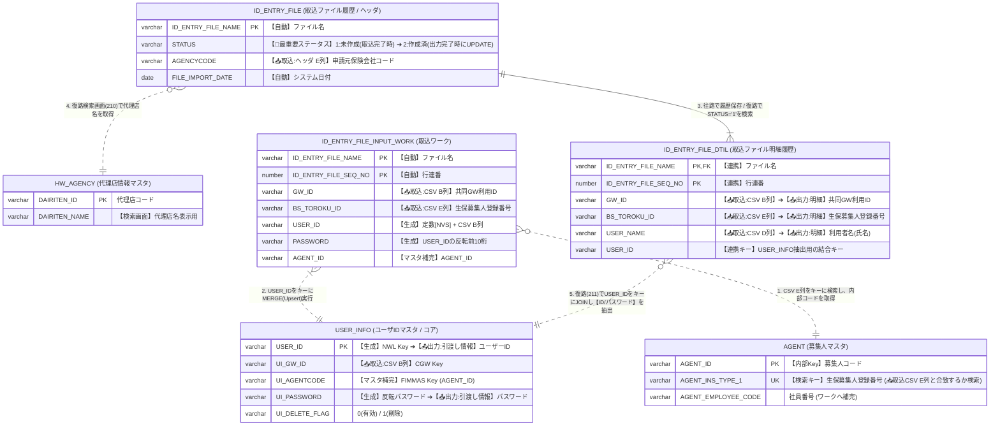

```mermaid
erDiagram
    %% ==========================================
    %% 1. マスタデータ層（Read-Only）
    %% ==========================================
    AGENT ["AGENT (募集人マスタ)"] {
        varchar AGENT_ID PK "【内部Key】募集人コード"
        varchar AGENT_INS_TYPE_1 UK "【検索キー】生保募集人登録番号 (📥取込CSV E列と合致するか検索)"
        varchar AGENT_EMPLOYEE_CODE "社員番号 (ワークへ補完)"
    }

    HW_AGENCY ["HW_AGENCY (代理店情報マスタ)"] {
        varchar DAIRITEN_ID PK "代理店コード"
        varchar DAIRITEN_NAME "【検索画面】代理店名表示用"
    }

    %% ==========================================
    %% 2. ワーク層（往路処理用）
    %% ==========================================
    ID_ENTRY_FILE_INPUT_WORK ["ID_ENTRY_FILE_INPUT_WORK (取込ワーク)"] {
        varchar ID_ENTRY_FILE_NAME PK "【自動】ファイル名"
        number ID_ENTRY_FILE_SEQ_NO PK "【自動】行連番"
        varchar GW_ID "【📥取込:CSV B列】共同GW利用ID"
        varchar BS_TOROKU_ID "【📥取込:CSV E列】生保募集人登録番号"
        varchar USER_ID "【生成】定数[NVS] + CSV B列"
        varchar PASSWORD "【生成】USER_IDの反転前10桁"
        varchar AGENT_ID "【マスタ補完】AGENT_ID"
    }

    %% ==========================================
    %% 3. 履歴・状態管理層（全体コントロール）
    %% ==========================================
    ID_ENTRY_FILE ["ID_ENTRY_FILE (取込ファイル履歴 / ヘッダ)"] {
        varchar ID_ENTRY_FILE_NAME PK "【自動】ファイル名"
        varchar STATUS "【🚨最重要ステータス】1:未作成(取込完了時) ➔ 2:作成済(出力完了時にUPDATE)"
        varchar AGENCYCODE "【📥取込:ヘッダ E列】申請元保険会社コード"
        date FILE_IMPORT_DATE "【自動】システム日付"
    }

    ID_ENTRY_FILE_DTIL ["ID_ENTRY_FILE_DTIL (取込ファイル明細履歴)"] {
        varchar ID_ENTRY_FILE_NAME PK, FK "【連携】ファイル名"
        number ID_ENTRY_FILE_SEQ_NO PK "【連携】行連番"
        varchar GW_ID "【📥取込:CSV B列】➔【📤出力:明細】共同GW利用ID"
        varchar BS_TOROKU_ID "【📥取込:CSV E列】➔【📤出力:明細】生保募集人登録番号"
        varchar USER_NAME "【📥取込:CSV D列】➔【📤出力:明細】利用者名(氏名)"
        varchar USER_ID "【連携キー】USER_INFO抽出用の結合キー"
    }

    %% ==========================================
    %% 4. コア層（本登録と出力用認証情報の源泉）
    %% ==========================================
    USER_INFO ["USER_INFO (ユーザIDマスタ / コア)"] {
        varchar USER_ID PK "【生成】NWL Key ➔【📤出力:引渡し情報】ユーザーID"
        varchar UI_GW_ID "【📥取込:CSV B列】CGW Key"
        varchar UI_AGENTCODE "【マスタ補完】FIMMAS Key (AGENT_ID)"
        varchar UI_PASSWORD "【生成】反転パスワード ➔【📤出力:引渡し情報】パスワード"
        varchar UI_DELETE_FLAG "0(有効) / 1(削除)"
    }

    %% ==========================================
    %% リレーションシップとデータ流転の解説
    %% ==========================================
    
    %% [往路: 照合とエンリッチメント]
    ID_ENTRY_FILE_INPUT_WORK }o..|| AGENT : "1. CSV E列をキーに検索し、内部コードを取得"
    
    %% [往路: コアへの本登録]
    ID_ENTRY_FILE_INPUT_WORK }|..|| USER_INFO : "2. USER_IDをキーにMERGE(Upsert)実行"
    
    %% [往復路のブリッジ]
    ID_ENTRY_FILE ||--|{ ID_ENTRY_FILE_DTIL : "3. 往路で履歴保存 / 復路でSTATUS='1'を検索"
    ID_ENTRY_FILE }o..|| HW_AGENCY : "4. 復路検索画面(210)で代理店名を取得"
    
    %% [復路: アンサーバック情報の抽出]
    ID_ENTRY_FILE_DTIL }o..|| USER_INFO : "5. 復路(211)でUSER_IDをキーにJOINし【ID/パスワード】を抽出"
```