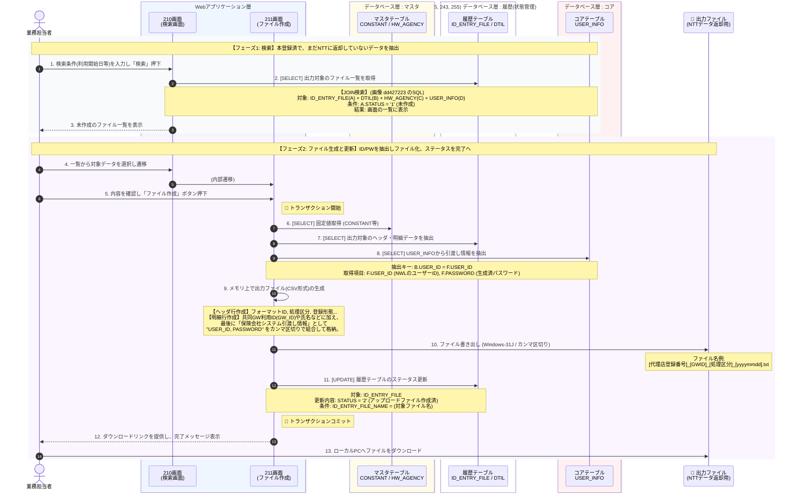

```mermaid
sequenceDiagram
    autonumber
    
    actor User as 業務担当者
    
    box rgb(239, 246, 255) Webアプリケーション層
    participant Web210 as 210画面<br>(検索画面)
    participant Web211 as 211画面<br>(ファイル作成)
    end
    
    box rgb(254, 252, 232) データベース層 : マスタ
    participant DB_MASTER as マスタテーブル<br>CONSTANT / HW_AGENCY
    end

    box rgb(245, 243, 255) データベース層 : 履歴(状態管理)
    participant DB_AUDIT as 履歴テーブル<br>ID_ENTRY_FILE / DTIL
    end

    box rgb(255, 241, 242) データベース層 : コア
    participant DB_USER as コアテーブル<br>USER_INFO
    end
    
    participant OutFile as 📄 出力ファイル<br>(NTTデータ返却用)

    %% ==========================================
    %% 第1フェーズ：出力対象の検索 (210.aspx)
    %% ==========================================
    rect rgb(248, 250, 252)
    Note over User, DB_USER: 【フェーズ1: 検索】本登録済で、まだNTTに返却していないデータを抽出
    
    User->>Web210: 1. 検索条件(利用開始日等)を入力し「検索」押下
    
    Web210->>DB_AUDIT: 2. [SELECT] 出力対象のファイル一覧を取得
    Note over Web210, DB_USER: 【JOIN検索】(画像 dd427223 のSQL)<br/>対象: ID_ENTRY_FILE(A) + DTIL(B) + HW_AGENCY(C) + USER_INFO(D)<br/>条件: A.STATUS = '1' (未作成)<br/>結果: 画面の一覧に表示
    
    Web210-->>User: 3. 未作成のファイル一覧を表示
    end

    %% ==========================================
    %% 第2フェーズ：ファイル生成と状態更新 (211.aspx)
    %% ==========================================
    rect rgb(250, 245, 255)
    Note over User, OutFile: 【フェーズ2: ファイル生成と更新】ID/PWを抽出しファイル化、ステータスを完了へ
    
    User->>Web210: 4. 一覧から対象データを選択し遷移
    Web210->>Web211: (内部遷移)
    User->>Web211: 5. 内容を確認し「ファイル作成」ボタン押下
    
    Note right of Web211: 🚨 トランザクション開始
    
    Web211->>DB_MASTER: 6. [SELECT] 固定値取得 (CONSTANT等)
    Web211->>DB_AUDIT: 7. [SELECT] 出力対象のヘッダ・明細データを抽出
    Web211->>DB_USER: 8. [SELECT] USER_INFOから引渡し情報を抽出
    Note over Web211, DB_USER: 抽出キー: B.USER_ID = F.USER_ID<br/>取得項目: F.USER_ID (NWLのユーザーID), F.PASSWORD (生成済パスワード)
    
    Web211->>Web211: 9. メモリ上で出力ファイル(CSV形式)の生成
    Note over Web211: 【ヘッダ行作成】フォーマットID, 処理区分, 登録形態...<br/>【明細行作成】共同GW利用ID(GW_ID)や氏名などに加え、<br/>最後に「保険会社システム引渡し情報」として<br/>"USER_ID, PASSWORD" をカンマ区切りで結合して格納。
    
    Web211->>OutFile: 10. ファイル書き出し (Windows-31J / カンマ区切り)
    Note over OutFile: ファイル名例:<br/>[代理店登録番号]_[GWID]_[処理区分]_[yyyymmdd].txt
    
    Web211->>DB_AUDIT: 11. [UPDATE] 履歴テーブルのステータス更新
    Note over Web211, DB_AUDIT: 対象: ID_ENTRY_FILE<br/>更新内容: STATUS = '2' (アップロードファイル作成済)<br/>条件: ID_ENTRY_FILE_NAME = (対象ファイル名)
    
    Note right of Web211: 🚨 トランザクションコミット
    
    Web211-->>User: 12. ダウンロードリンクを提供し、完了メッセージ表示
    User->>OutFile: 13. ローカルPCへファイルをダウンロード
    end
```