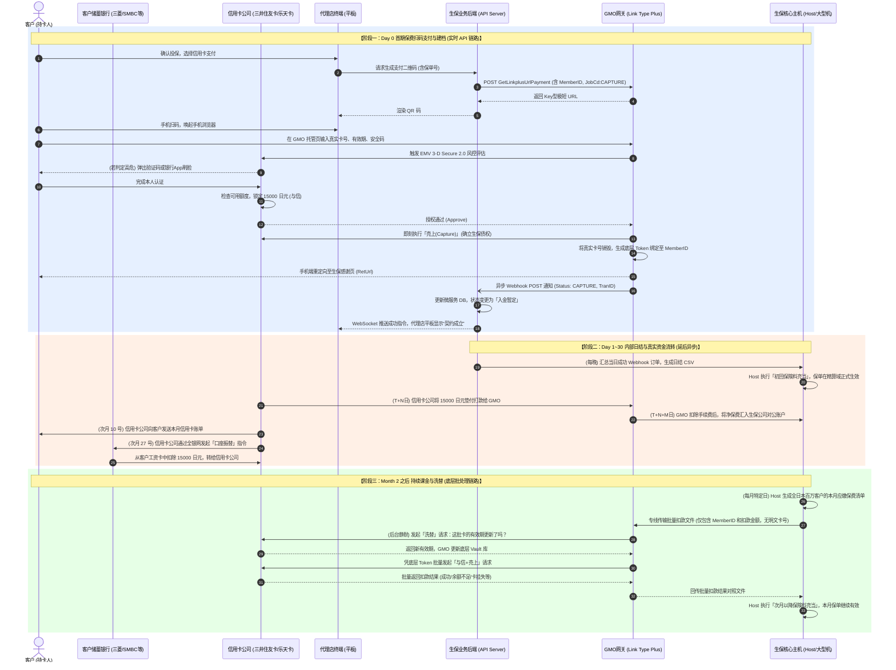

    

```mermaid
sequenceDiagram
    autonumber
    
    actor C as 客户 (持卡人)
    participant Bank as 客户储蓄银行 (三菱/SMBC等)
    participant Issuer as 信用卡公司 (三井住友卡/乐天卡)
    participant T as 代理店终端 (平板)
    participant S as 生保业务后端 (API Server)
    participant G as GMO网关 (Link Type Plus)
    participant H as 生保核心主机 (Host/大型机)

    rect rgb(230, 240, 255)
    Note over C, H: 【阶段一：Day 0 首期保费扫码支付与建档 (实时 API 链路)】
    C->>T: 确认投保，选择信用卡支付
    T->>S: 请求生成支付二维码 (含保单号)
    S->>G: POST GetLinkplusUrlPayment (含 MemberID, JobCd:CAPTURE)
    G-->>S: 返回 Key型极短 URL
    S-->>T: 渲染 QR 码
    C->>T: 手机扫码，唤起手机浏览器
    C->>G: 在 GMO 托管页输入真实卡号、有效期、安全码
    
    %% 3DS 2.0 与信与卖上
    G->>Issuer: 触发 EMV 3-D Secure 2.0 风控评估
    Issuer-->>C: (若判定高危) 弹出验证码或银行App刷脸
    C->>Issuer: 完成本人认证
    Issuer->>Issuer: 检查可用额度，锁定 15000 日元 (与信)
    Issuer-->>G: 授权通过 (Approve)
    G->>Issuer: 即刻执行「売上(Capture)」(确立生保债权)
    
    %% 凭证隔离与回调
    G->>G: 将真实卡号销毁，生成底层 Token 绑定至 MemberID
    G-->>C: 手机端重定向至生保感谢页 (RetUrl)
    G-)S: 异步 Webhook POST 通知 (Status: CAPTURE, TranID)
    S->>S: 更新微服务 DB，状态变更为「入金暂定」
    S-->>T: WebSocket 推送成功指令，代理店平板显示“契约成立”
    end

    rect rgb(255, 240, 230)
    Note over S, H: 【阶段二：Day 1~30 内部日结与真实资金流转 (延后异步)】
    S->>H: (每晚) 汇总当日成功 Webhook 订单，生成日结 CSV
    H->>H: Host 执行「初回保険料充当」，保单在精算域正式生效
    
    %% 真实的钱是怎么动的
    Issuer->>G: (T+N日) 信用卡公司将 15000 日元垫付打款给 GMO
    G->>H: (T+N+M日) GMO 扣除手续费后，将净保费汇入生保公司对公账户
    Issuer->>C: (次月 10 号) 信用卡公司向客户发送本月信用卡账单
    Issuer->>Bank: (次月 27 号) 信用卡公司通过全银网发起「口座振替」指令
    Bank->>Issuer: 从客户工资卡中扣除 15000 日元，转给信用卡公司
    end

    rect rgb(230, 255, 230)
    Note over C, H: 【阶段三：Month 2 之后 持续课金与洗替 (底层批处理链路)】
    H->>H: (每月特定日) Host 生成全日本百万客户的本月应缴保费清单
    H->>G: 专线传输批量扣款文件 (仅包含 MemberID 和扣款金额，无明文卡号)
    
    %% 洗替机制 (有效期自动更新)
    G->>Issuer: (后台静默) 发起「洗替」请求：这批卡的有效期更新了吗？
    Issuer-->>G: 返回新有效期，GMO 更新底层 Vault 库
    
    %% 自动扣款
    G->>Issuer: 凭底层 Token 批量发起「与信+売上」请求
    Issuer-->>G: 批量返回扣款结果 (成功/余额不足/卡挂失等)
    G-->>H: 回传批量扣款结果对照文件
    H->>H: Host 执行「次月以降保険料充当」，本月保单继续有效
    end
```