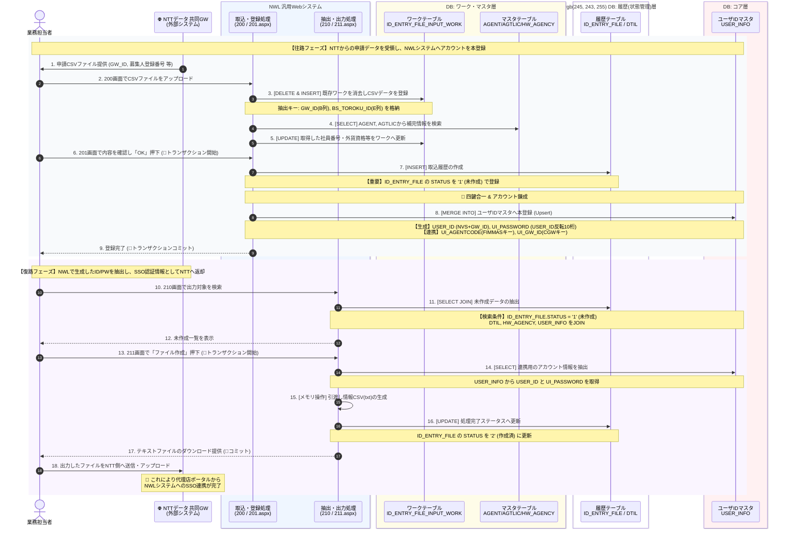

sequenceDiagram
    autonumber
    

```mermaid
sequenceDiagram
    autonumber
    
    actor User as 業務担当者
    participant NTT as 🌐 NTTデータ 共同GW<br>(外部システム)
    
    box rgb(239, 246, 255) NWL 汎用Webシステム
    participant Web_In as 取込・登録処理<br>(200 / 201.aspx)
    participant Web_Out as 抽出・出力処理<br>(210 / 211.aspx)
    end
    
    box rgb(254, 252, 232) DB: ワーク・マスタ層
    participant DB_WORK as ワークテーブル<br>ID_ENTRY_FILE_INPUT_WORK
    participant DB_MASTER as マスタテーブル<br>AGENT/AGTLIC/HW_AGENCY
    end

    box rgb(245, 243, 255) DB: 履歴(状態管理)層
    participant DB_AUDIT as 履歴テーブル<br>ID_ENTRY_FILE / DTIL
    end

    box rgb(255, 241, 242) DB: コア層
    participant DB_USER as ユーザIDマスタ<br>USER_INFO
    end

    %% ==========================================
    %% 【往路】取込と本登録フェーズ (200 / 201)
    %% ==========================================
    rect rgb(248, 250, 252)
    Note over User, DB_USER: 【往路フェーズ】NTTからの申請データを受領し、NWLシステムへアカウントを本登録
    
    NTT->>User: 1. 申請CSVファイル提供 (GW_ID, 募集人登録番号 等)
    User->>Web_In: 2. 200画面でCSVファイルをアップロード
    
    Web_In->>DB_WORK: 3. [DELETE & INSERT] 既存ワークを消去しCSVデータを登録
    Note over Web_In, DB_WORK: 抽出キー: GW_ID(B列), BS_TOROKU_ID(E列) を格納
    
    Web_In->>DB_MASTER: 4. [SELECT] AGENT, AGTLICから補完情報を検索
    Web_In->>DB_WORK: 5. [UPDATE] 取得した社員番号・外貨資格等をワークへ更新
    
    User->>Web_In: 6. 201画面で内容を確認し「OK」押下 (🚨トランザクション開始)
    
    Web_In->>DB_AUDIT: 7. [INSERT] 取込履歴の作成
    Note over Web_In, DB_AUDIT: 【重要】ID_ENTRY_FILE の STATUS を '1' (未作成) で登録
    
    Note over Web_In, DB_USER: 🌟 四鍵合一 & アカウント錬成
    Web_In->>DB_USER: 8. [MERGE INTO] ユーザIDマスタへ本登録 (Upsert)
    Note over Web_In, DB_USER: 【生成】USER_ID (NVS+GW_ID), UI_PASSWORD (USER_ID反転10桁)<br>【連携】UI_AGENTCODE(FIMMASキー), UI_GW_ID(CGWキー)
    
    Web_In-->>User: 9. 登録完了 (🚨トランザクションコミット)
    end

    %% ==========================================
    %% 【復路】抽出とアンサーバックフェーズ (210 / 211)
    %% ==========================================
    rect rgb(250, 245, 255)
    Note over User, NTT: 【復路フェーズ】NWLで生成したID/PWを抽出し、SSO認証情報としてNTTへ返却
    
    User->>Web_Out: 10. 210画面で出力対象を検索
    
    Web_Out->>DB_AUDIT: 11. [SELECT JOIN] 未作成データの抽出
    Note over Web_Out, DB_USER: 【検索条件】ID_ENTRY_FILE.STATUS = '1' (未作成)<br>DTIL, HW_AGENCY, USER_INFO をJOIN
    
    Web_Out-->>User: 12. 未作成一覧を表示
    
    User->>Web_Out: 13. 211画面で「ファイル作成」押下 (🚨トランザクション開始)
    
    Web_Out->>DB_USER: 14. [SELECT] 連携用のアカウント情報を抽出
    Note over Web_Out, DB_USER: USER_INFO から USER_ID と UI_PASSWORD を取得
    
    Web_Out->>Web_Out: 15. [メモリ操作] 引渡し情報CSV(txt)の生成
    
    Web_Out->>DB_AUDIT: 16. [UPDATE] 処理完了ステータスへ更新
    Note over Web_Out, DB_AUDIT: ID_ENTRY_FILE の STATUS を '2' (作成済) に更新
    
    Web_Out-->>User: 17. テキストファイルのダウンロード提供 (🚨コミット)
    
    User->>NTT: 18. 出力したファイルをNTT側へ送信・アップロード
    
    Note over NTT: 🤝 これにより代理店ポータルから<br>NWLシステムへのSSO連携が完了
    end
```